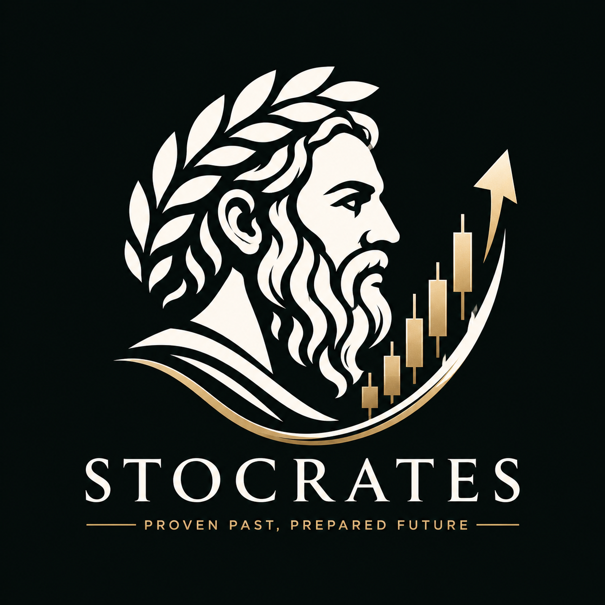

# Stocrates



> *Stock + Socrates* — Proven Past, Prepared Future

An educational AI-powered financial literacy platform that teaches beginners how markets react to real-world events through historical pattern analysis and the Socratic Method. Built with Next.js 16, Groq AI (Llama 3.3-70B), and live market data.


---

## What is Stocrates?

Stocrates does not give financial advice. It teaches you how to think about markets.

Every interaction follows the Socratic method: instead of answering "should I buy this stock?", Stocrates shows you what happened historically in similar situations, asks you what patterns you notice, and guides you to form your own conclusions. The goal is financial literacy, not stock tips.

---

## Features

### AI Chat with Socratic Method
- Conversational AI powered by Groq (Llama 3.3-70B) via Vercel AI SDK
- Socratic questioning to guide learning and critical thinking rather than giving direct answers
- Historical pattern matching for every stock or market event
- Source credibility weighting: credible sources (Bloomberg, Reuters, WSJ) weighted 60-80%, social media 20-30%
- Streaming responses with auto-scroll and a stop-generating button
- Copy any AI message to clipboard with one click
- Context-aware follow-up question chips after each response

### Halal / Shariah-Compliant Mode
- Toggle between Standard and Halal mode in the header
- Halal mode applies full AAOIFI screening criteria to every stock analysis:
  - Primary screen: business activity (riba, alcohol, tobacco, pork, weapons, gambling, adult entertainment)
  - Secondary screen: debt ratio, interest income, and haram revenue thresholds
- References certified sources only: Islamicly, Zoya, Dow Jones Islamic Market Index, MSCI Islamic Indexes, IdealRatings, FTSE Russell Islamic Index Series
- Never definitively declares a stock halal or haram - uses "passes standard AAOIFI screening" language and always directs to certified screeners
- Mode persists across sessions via localStorage

### Live Market Data via TradingView
- Real-time stock charts and prices
- Company financials and key metrics
- Stock screener for discovery
- Market overview, sector heatmaps, and ETF analysis
- Trending stocks by gainers, losers, and most active

### Multi-Source News Integration
- Finnhub for financial news and earnings
- NewsAPI aggregating Bloomberg, Reuters, WSJ, and 100+ sources
- 7-layer fallback system: service degradation is graceful, never a hard failure

### Investment Game (Paper Trading)
- Practice investing with virtual Stocrates Points (risk-free)
- Historical time travel: revisit past market events and practice decisions
- Portfolio tracking and performance analysis
- Investment feedback with educational context

### Event Impact Analyzer
- Historical pattern matching for specific market events
- Pattern confidence visualization
- Source credibility breakdown per event
- CSV export for further analysis

### Visual Confidence Indicators
- Color-coded progress bars per response (green 70%+, yellow 50%+, red below 50%)
- Separate credible-source confidence and social-sentiment confidence
- Automatically parsed from AI responses

---

## Quick Start

### Requirements

- Node.js 18+ and pnpm 8+
- A free Groq API key (the only required key)

### 1. Clone and install

```bash
git clone https://github.com/makhskham/Stocrates.git
cd Stocrates
pnpm install
```

### 2. Set environment variables

Create `.env.local` in the root:

```env
# Required - get free at console.groq.com
GROQ_API_KEY=gsk_your_key_here

# Optional - improves news context quality
FINNHUB_API_KEY=     # finnhub.io, free tier: 60 req/min
NEWS_API_KEY=        # newsapi.org, free tier: 100 req/day
POLYGON_API_KEY=     # polygon.io, free tier: 5 req/min
```

Stocrates runs with only `GROQ_API_KEY`. The optional keys improve news enrichment but are not required to start.

### 3. Run

```bash
pnpm dev
```

Open [http://localhost:3000](http://localhost:3000).

### Deploy to Vercel

1. Push to GitHub (already done)
2. Go to [vercel.com/new](https://vercel.com/new) and import this repo
3. Add `GROQ_API_KEY` as an environment variable
4. Deploy

Every push to `main` auto-deploys.

---

## Usage

### Standard mode

Ask questions about any publicly traded company or market:

- "Show me Tesla's chart and explain what I am looking at"
- "What happens when a tech company announces a major partnership?"
- "How do markets typically react to earnings announcements?"
- "Show me the market heatmap and explain the sectors"

### Halal mode

Toggle to Halal in the header, then ask:

- "Is Apple considered halal under AAOIFI standards?"
- "Which technology stocks pass Shariah screening?"
- "Explain what makes a stock halal and how to verify it"
- "Show me sectors that are generally considered permissible"

---

## Project Structure

```
Stocrates/
├── app/
│   ├── (chat)/              # Main chat interface
│   ├── api/                 # API routes (analyze-event, historical-price, price-prediction)
│   ├── events/              # Event Impact Analyzer page
│   ├── layout.tsx           # Root layout with ModeProvider + GameProvider
│   ├── error.tsx            # Error boundary with Try Again + New Chat
│   ├── robots.ts            # robots.txt
│   └── sitemap.ts           # sitemap.xml
├── components/
│   ├── game/                # Investment game sidebar and panels
│   ├── stocks/              # Message bubbles (UserMessage, BotMessage, BotCard)
│   ├── tradingview/         # TradingView widget wrappers
│   ├── ui/                  # shadcn/ui components + custom (mode-selector, confidence-display)
│   ├── header.tsx           # Navigation with mode selector and game toggle
│   ├── empty-screen.tsx     # Welcome screen (adapts to halal/standard mode)
│   ├── chat.tsx             # Main chat orchestrator
│   ├── chat-panel.tsx       # Fixed bottom input panel
│   └── prompt-form.tsx      # Input form with stop button and follow-up chips
├── lib/
│   ├── chat/
│   │   └── actions.tsx      # AI tool definitions, streamUI, generateCaption (token-optimised)
│   ├── modes/
│   │   ├── types.ts         # StocatesMode type ('standard' | 'halal')
│   │   ├── halal.ts         # AAOIFI screening criteria and certified source references
│   │   └── mode-context.tsx # React context with localStorage persistence
│   ├── game/                # Paper trading logic and context
│   ├── hooks/               # use-scroll-anchor (MutationObserver auto-scroll), use-copy-to-clipboard
│   ├── news/                # News fetching: Finnhub, NewsAPI, fallback chain
│   ├── stocks/              # Price prediction service
│   └── analyze-event/       # Polygon candle data and event detection
├── scripts/                 # Dev scripts for Reddit scraping and analysis
└── public/                  # Static assets
```

---

## Token Efficiency

Stocrates is designed to make the free Groq tier last as long as possible:

- **History truncation**: only the last 6 messages are sent per request, not the full conversation
- **Concise caption prompt**: the educational text prompt is 150 tokens, down from 600+ in the original version
- **News fetch scoped**: 14-day window, 3 articles max, titles and sentiment only (not full snippets)
- **`maxTokens: 450`** on caption generation: output is bounded, not open-ended
- **Groq caching**: the system prompt prefix is stable across standard-mode requests, so Groq caches it automatically (cached tokens are free and do not count toward rate limits)

---

## Design System

- Colors: cream (`#fffcf0`), dark (`#22271e`), accent blue (`#a7dcfa`)
- Typography: Space Mono (titles, game elements), Roboto (body text)
- Animations: `ease-out-quint` cubic-bezier curves, `fade-up` on mount
- No side-stripe borders, no gradient text, no glassmorphism as default

---

## Disclaimer

Stocrates is an educational tool only. It does not provide financial advice, investment recommendations, or trading signals. All information is for educational purposes. The Halal screening feature is informational and based on AAOIFI standard methodology. Always verify compliance on certified platforms (Islamicly, Zoya) and consult a qualified Shariah advisor before making financial decisions. Always do your own research and consult with a qualified financial advisor before making any investment decisions.

---

## License

MIT — built by Team Code of Duty
